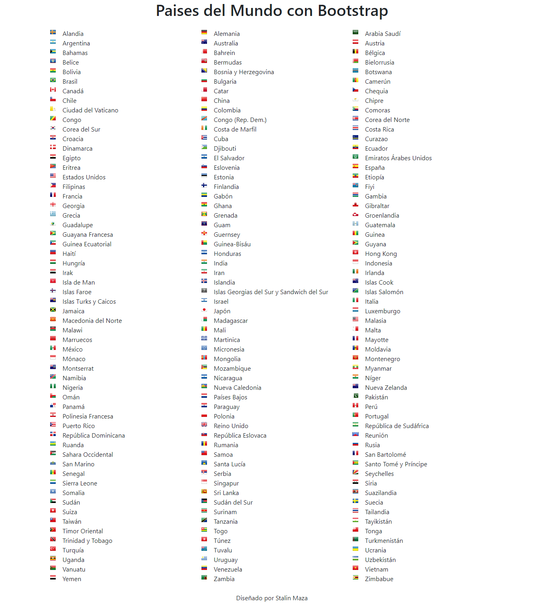

# Paises del Mundo con Bootstrap

Este ejemplo solo utiliza un pequeño archivo CSS combinado con una imagen tipo sprite con las banderas de los Paises.

## Archivos necesarios:
- bootstrap-countries.css
- countries.json

## Configuración necesaria
El directorio de elementos HTML debe manejarse de la siguiente manera:

- elementoPadre con clase **countryFlagIconWrapper** y necesita dos elementos hijos.
  
  - elemento con clase **countryFlagIcon** combinada con el valor del pais y la propiedad **flatCode**
  - elemento simple que contendra el nombre del pais, código numerico ó cualquier otro dato que se desee utilizar.

## Listado de Paises

